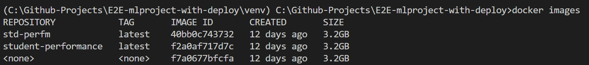

# Deploying ML models as web service to cloud #

Serving a machine learning model as a web service

Tech stack: Python, Flask, Docker, AWS ECR/EC2, CI/CD


## Objective
Be acquainted with development workflow, and related tech stack, and get the first taste of building an ML production system.

## Training a machine learning model on a local system
1. [EDA.ipynb](https://github.com/zhaoshijie1248/E2E_mlproject_with_deployment/blob/main/notebook/1%20.%20EDA%20STUDENT%20PERFORMANCE%20.ipynb): exploratory data analysis and visualization
2. [data_ingestion.py](https://github.com/zhaoshijie1248/E2E_mlproject_with_deployment/blob/main/src/components/data_ingestion.py): read data and split them into train set and test set

3. [data_transformation.py](https://github.com/zhaoshijie1248/E2E_mlproject_with_deployment/blob/main/src/components/data_transformation.py): standard scale on numerical features and do one-hot encoding on categorial features


4. [model_trainer.py](https://github.com/zhaoshijie1248/E2E_mlproject_with_deployment/blob/main/src/components/model_trainer.py): apply classification algorithms, including Random Forest, Decision Tree, Gradient Boosting, Linear Regression, XGBRegressor, CatBoosting Regressor, AdaBoost Regressor. 

The model with best performance will be stored as a pickle file which is a serialized format for storing objects. In the repo, the file is named ['model.pkl'](https://github.com/zhaoshijie1248/E2E_mlproject_with_deployment/blob/main/artifacts/model.pkl)

## Wrapping the inference logic into a flask web service

We are prepared to utilize pickle file for obtaining a class label for a test sample through querying the model. The process of inference is straightforward and involves invoking a predict() function on the trained model using the test data. Yet, our intention is to construct this inference process as a web service. To achieve this goal, we plan to employ Flask.

Flask is a powerful python microwebserver framework that allows us to build REST API based web-services quickly with minimum configuration hassle. Let’s dive into the code:

a. we instantiate a Flask object called ‘app’:
```
app=Flask(__name__)
 ```

b. Now, we define a home endpoint, which when hit, returns a ‘Welcome to the home page’ message.
```
@app.route('/')
def index():
    return render_template('index.html') 
```

c. We define a ‘predictdata’ endpoint. The endpoint accepts 'GET' and ‘POST’ request where in the test data on which we wish to get a prediction is received by the endpoint. 
```
@app.route('/predictdata',methods=['GET','POST'])
def predict_datapoint():
    if request.method=='GET':
        return render_template('home.html')
    else:
        data=CustomData(
            gender=request.form.get('gender'),
            race_ethnicity=request.form.get('ethnicity'),
            parental_level_of_education=request.form.get('parental_level_of_education'),
            lunch=request.form.get('lunch'),
            test_preparation_course=request.form.get('test_preparation_course'),
            reading_score=float(request.form.get('writing_score')),
            writing_score=float(request.form.get('reading_score'))

        )
        pred_df=data.get_data_as_data_frame()
        print(pred_df)
        print("Before Prediction")

        predict_pipeline=PredictPipeline()
        print("Mid Prediction")
        results=predict_pipeline.predict(pred_df)
        print("after Prediction")
        return render_template('home.html',results=results[0])
    
```
d. Finally, declare the main function:
```
if __name__=="__main__":
    app.run(host="0.0.0.0",port=5000)  
```
Execute the command ```python app.py``` from the terminal. Go to the browser and hit the url http://127.0.0.1:5000 to get a message 'Welcome to the home page' displayed.


Go to the url http://127.0.0.1:5000/predictdata and input the features, it will return predicted result.


## Using docker to containerize the flask service

a. Run ```docker build -t student-performance .``` to build the docker image using ```Dockerfile```. 
```
FROM python:3.8-slim-buster 
WORKDIR /app
COPY . /app
RUN apt update -y && apt install awscli -y
RUN apt-get update && apt-get install ffmpeg libsm6 libxext6 unzip -y && pip install -r requirements.txt
CMD ["python3", "application.py"]
```
Use command ```docker images``` to see a docker image with a docker repository named ‘student-performance’ created. 


  
b. Run ```docker run -p 5000:5000 student-performance``` to run the docker container that got generated using the `student-performance` docker image. 

The above commands uses -p flag to map port 5000 of the local system to the port 5000 of the docker container for the redirection of traffic on local HTTP port 5000 to port 5000 of the container. Now, with the help of local host by using port 5000, we can access the application present in the container.

## Hosting the docker container on an AWS EC2

We already have a containerized application that works on our local system. To make others someone consume the service, we will choose to host our service on AWS EC2.

a. set up github [workflow](https://github.com/zhaoshijie1248/E2E_mlproject_with_deployment/.github/workflows/main.yaml) and commit all code to github repo
b. set up IAM user in AWS
c. create new ECR repo
d. create new EC2 instance (Ubuntu, t2.medium, Allow HTTP/HTTPS traffic from the Internet) and finish Docker setup In EC2 by input following commands in EC2 console
```
#optinal
sudo apt-get update -y
sudo apt-get upgrade
#required
curl -fsSL https://get.docker.com -o get-docker.sh
sudo sh get-docker.sh
sudo usermod -aG docker ubuntu
newgrp docker
```
e. create a self-hosted runner and customize the environment used to run jobs in GitHub Actions workflows
f. manage configuration data by create repository secrets like AWS_ACCESS_KEY_ID, AWS_ECR_LOGIN_URI, AWS_REGION, AWS_SECRET_ACCESS_KEY, ECR_REPOSITORY_NAME

g. check CI/CD workflow run correctly or not by commiting tiny changes in application.py file. it shows every update pushed to github repo will trigger auromatically integrate and deployment.


credit to:
https://towardsdatascience.com/simple-way-to-deploy-machine-learning-models-to-cloud-fd58b771fdcf
https://github.com/tanujjain/deploy-ml-model/blob/master/README.md
